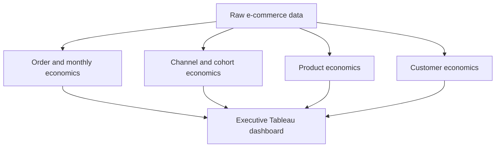

# E-Commerce Executive Economics - Project Overview
Revenue decline, contribution economics and customer value

## The project's goal is to identify why e-commerce revenue is declining, where contribution profit is being lost and which channels, products and customer groups require management action.

This project analyzes five years of interconnected e-commerce data covering customers, orders, products, marketing, fulfilment, payments, returns, inventory and operating costs. The purpose is to move beyond revenue reporting and determine whether the business is creating economic value after product, service, fulfilment and acquisition costs.

Management needs to understand whether the latest revenue movement represents a sustainable recovery, how much revenue survives as contribution profit, whether paid acquisition recovers its cost, which products create or destroy value and where customer-level action should be concentrated. The analysis therefore connects company performance with channel, cohort, product and customer economics.

The central management question is:

> **Why is revenue declining, where is contribution leaking, which acquisition channels, products and customer groups create or destroy value and what should management do next.**

## Dataset structure

The portfolio dataset covers January 2021 to December 2025 and contains approximately 20 tables at their lowest available grain. The data includes customer and product dimensions plus transactional tables for orders, order lines, marketing, web sessions, payments, shipments, returns, refunds, inventory, prices, product costs and operating costs.

SQL outputs were used instead of one physical mega-join. This preserves the natural grain of each analysis and prevents duplicated revenue, marketing spend or customer values.

| Dashboard component | Primary dataset | Grain |
|---|---|---|
| Executive KPIs and revenue bridge | `ecom_monthly_economics_summary` | Month |
| CLV:CAC KPI and channel economics | `ecom_clv_cac_analysis` | Acquisition cohort month × channel |
| Acquisition cohort contribution | `ecom_acquisition_cohort_economics` | Cohort month × channel × cohort age |
| Product Economics Matrix | `ecom_product_profitability_portfolio` | Product × selected period |
| Customer Profitability Mix | `ecom_customer_month_economics` | Customer × month snapshot |

## Insights Summary

#### In order to evaluate the economic health of the business, I focused on the following key metrics. Together they connect revenue performance with profitability, acquisition efficiency, product economics and customer value.

- **Recognized Revenue**: Product and realized shipping revenue after successful refunds, excluding tax.
- **Contribution Profit**: CM2 contribution after deducting marketing investment.
- **Contribution Margin**: Contribution profit divided by recognized revenue.
- **Average Order Value**: Recognized revenue per completed order.
- **Refund Rate**: Successful refund value as a percentage of the relevant revenue base.
- **365-day Contribution CLV:CAC**: Weighted 365-day CM2 contribution divided by acquisition investment for the eligible mature paid-channel population.

#### Recognized Revenue

**Latest month:** Recognized revenue reached **€79,151 in December 2025**, an increase of **18.8%** from November. Despite the monthly rebound, revenue remained **38.7% below December 2024**, so the improvement did not reverse the longer-term decline.

**Trend:** The trailing 12-month view shows revenue strengthening toward December while contribution remained negative during most of the period. This indicates that higher sales did not consistently translate into final economic value.

#### Contribution Profit and Contribution Margin

**Latest month:** Contribution profit was **€836**, improving by **€5,853** from the previous month but remaining **€7,143 below the previous year**. The business moved from a monthly loss to a small positive result.

**Margin quality:** Contribution margin reached only **1.1%**. It improved by **8.6 percentage points month over month** but remained **5.1 percentage points below the previous year**. A small change in cost, refunds or acquisition spending could therefore move the business back into loss.

#### Average Order Value and Refund Rate

**Average order value:** December AOV was **€175**, up **5.9% month over month** and **8.4% year over year**. The increase helped the December revenue recovery, but it was not sufficient to generate a strong final margin.

**Refund rate:** The refund rate was **11.7%**, improving by **1.4 percentage points from November** and **0.3 percentage points from December 2024**. Refund performance improved, but the remaining rate still affects revenue quality, product economics and fulfilment cost.

#### Revenue-to-Contribution Bridge (Waterfall)

The bridge reconciles December recognized revenue through the main cost layers:

| Bridge component | Amount | Interpretation |
|---|---:|---|
| Recognized revenue | €79,151 | Starting revenue base |
| Net landed COGS | -€48,799 | 61.7% of revenue |
| Outbound shipping | -€6,057 | 7.7% of revenue |
| Payment processing | -€2,805 | 3.5% of revenue |
| Return shipping | -€776 | Cost created by returns |
| Return processing | -€438 | Operational return cost |
| CM2 contribution | €20,275 | 25.6% margin before marketing |
| Marketing investment | -€19,439 | Consumed 95.9% of CM2 |
| Contribution profit | €836 | 1.1% final contribution margin |

The largest management issue is the combination of a limited CM2 margin and marketing investment that absorbed almost all the value remaining after product and operating costs.

#### Acquisition Economics

The weighted **365-day Contribution CLV:CAC was 0.16x**. For each €1 invested in paid customer acquisition, the eligible mature cohorts generated only €0.16 of CM2 contribution within 365 days. This is well below the **1.0x break-even level** and the **3.0x target shown in the dashboard**.

| Acquisition channel | Blended CAC | 365-day CLV:CAC |
|---|---:|---:|
| Paid Social | €314 | 0.14x |
| Paid Search | €297 | 0.15x |
| Affiliate | €192 | 0.26x |

Affiliate produced the strongest result among the displayed channels, but it still failed to recover acquisition cost. Paid Social combined the highest CAC with the weakest ratio and should be reviewed first.

The headline KPI reconciles with the channel view: both use the same mature-cohort window, paid-media inclusion rule and additive numerator-over-denominator calculation. The total 0.16x result is therefore a weighted ratio rather than an average of channel ratios.

#### Acquisition Cohort Contribution

The twelve 2025 acquisition cohorts contain **503 acquired customers**. Every displayed cohort was negative after CAC at M00 and remained negative through its available observation period.

The newer cohorts have fewer observable months, so results must be compared at equal cohort ages. Even with this limitation, the heatmap indicates that repeat-order contribution was not closing the initial acquisition deficit quickly enough.

#### Product Economics

The Product Economics Matrix compares recognized revenue with CM2 contribution margin and identifies profitable, low-margin, loss-making, high-return and stockout-affected products.

Higher-revenue products generally remained above zero contribution, but many were close to the **12.9% portfolio reference margin**. A long tail of low-revenue products was loss-making, including several extreme negative-margin outliers.

Revenue alone is therefore not a sufficient product-management measure. Product decisions should combine revenue, negative CM2 euros, margin, refund behavior and inventory availability.

#### Customer Profitability Mix

| Customer status | Customers | Share | Cumulative profit after CAC |
|---|---:|---:|---:|
| Customer Unprofitable After CAC | 4,993 | 31.5% | -€712.6K |
| High Refund Leakage | 78 | 0.5% | €6.1K |
| Reactivation Needed | 6,082 | 38.4% | €966.4K |
| Second Purchase Needed | 3,695 | 23.3% | €232.4K |
| Healthy / Monitor | 1,004 | 6.3% | €135.9K |
| **Total** | **15,852** | **100.0%** | **€628.2K** |

The most urgent negative pool consists of **4,993 customers** whose cumulative result after CAC was **-€712.6K**, approximately -€143 per customer.

At the same time, the Reactivation Needed and Second Purchase Needed groups contain **9,777 customers**, or **61.7% of the customer base**, and represent €1.20M of historical cumulative contribution. This is value at risk rather than guaranteed future profit, so action should be prioritized by prior contribution, recency and likely incremental return.

## Recommendations

- **Reset paid-acquisition decisions:** Audit Paid Social, Paid Search and Affiliate by mature cohort. Reduce or redesign spending that cannot show a credible path toward 1.0x contribution CLV:CAC.

- **Protect contribution before scaling revenue:** Use contribution after marketing—not revenue alone—as the primary economic guardrail for budget decisions.

- **Launch a second-purchase program:** Build post-first-order journeys around replenishment timing, complementary products and contribution-safe offers for the 3,695 customers who have not made a second purchase.

- **Prioritize reactivation by value:** Target dormant customers using prior contribution and recency. Measure incremental contribution and cost per reactivation rather than campaign engagement alone.

- **Remediate unprofitable customer patterns:** Diagnose acquisition cost, discounts, returns, shipping and product mix for the 4,993 unprofitable customers, then apply recover, restrict or stop rules.

- **Rationalize the product portfolio:** Rank products by negative CM2 euros. Reprice, delist or correct sourcing, returns and fulfilment problems before increasing promotion.

- **Investigate high-return and stockout-affected products:** Review return reasons, product information, quality, packaging and replenishment for products where operational problems reduce contribution.

## Dashboard

The Tableau dashboard follows a management sequence from monitoring to diagnosis and action:

1. Executive KPIs show the current financial position and period comparisons.
2. The trend and revenue bridge explain how revenue becomes contribution profit.
3. Channel and cohort views test whether customer acquisition creates value.
4. Product and customer views identify the areas requiring intervention.

The month and year selectors support a repeatable management review. Contribution profit comparisons use euro changes when results cross zero, while contribution margin and refund rate use percentage-point changes. The headline CLV:CAC and channel view use the same mature paid-channel population and reconcile to the weighted 0.16x result.

> **Tableau Public:** Add the published workbook link here.

### Main conclusion

The business has a **revenue-quality problem**, not only a revenue-volume problem. December revenue recovered from November, but remained well below the previous year. Marketing consumed almost all CM2, paid acquisition did not recover CAC within 365 days, recent cohorts remained negative after acquisition cost and most customers required profitability, repeat-purchase or reactivation action.

The immediate priority is to restore contribution quality before scaling acquisition or revenue.

