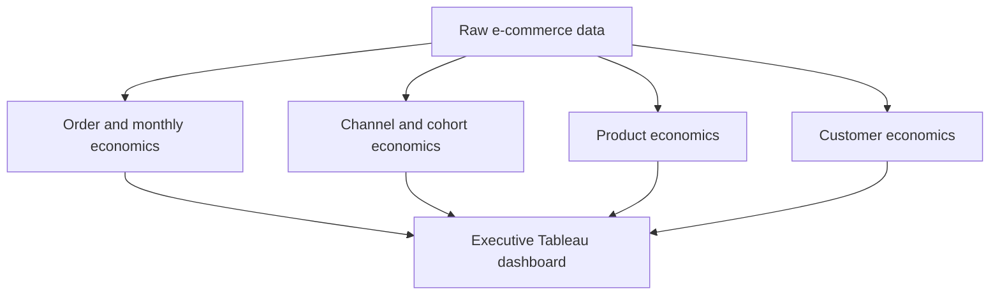

# E-Commerce Executive Economics - Project Overview
Revenue decline, contribution economics and customer value

## The project's goal is to identify why e-commerce revenue is declining, where contribution profit is being lost and which channels, products and customer groups require management action.

This project analyzes five years of interconnected e-commerce data covering customers, orders, products, marketing, fulfilment, payments, returns, inventory and operating costs. The purpose is to move beyond revenue reporting and determine whether the business is creating economic value after product, service, fulfilment and acquisition costs.

Management needs to understand whether the latest revenue movement represents a sustainable recovery, how much revenue survives as contribution profit, whether paid acquisition recovers its cost, which products create or destroy value and where customer-level action should be concentrated. The analysis therefore connects company performance with channel, cohort, product and customer economics.

The central management question is:

> **Why is revenue declining, where is contribution leaking, which acquisition channels, products and customer groups create or destroy value and what should management do next.**

## Dataset structure

The portfolio dataset covers January 2021 to December 2025 and contains approximately 20 tables at their lowest available grain. The data includes customer and product dimensions plus transactional tables for orders, order lines, marketing, web sessions, payments, shipments, returns, refunds, inventory, prices, product costs and operating costs.

SQL outputs were used instead of one physical mega-join. This preserves the natural grain of each analysis and prevents duplicated revenue, marketing spend or customer values.

| Dashboard component | Primary dataset | Grain |
|---|---|---|
| Executive KPIs and revenue bridge | `ecom_monthly_economics_summary` | Month |
| CLV:CAC KPI and channel economics | `ecom_clv_cac_analysis` | Acquisition cohort month × channel |
| Acquisition cohort contribution | `ecom_acquisition_cohort_economics` | Cohort month × channel × cohort age |
| Product Economics Matrix | `ecom_product_profitability_portfolio` | Product × selected period |
| Customer Profitability Mix | `ecom_customer_month_economics` | Customer × month snapshot |

## Insights Summary

#### In order to evaluate the economic health of the business, I focused on the following key metrics. Together they connect revenue performance with profitability, acquisition efficiency, product economics and customer value.

- **Recognized Revenue**: Product and realized shipping revenue after successful refunds, excluding tax.
- **Contribution Profit**: CM2 contribution after deducting marketing investment.
- **Contribution Margin**: Contribution profit divided by recognized revenue.
- **Average Order Value**: Recognized revenue per completed order.
- **Refund Rate**: Successful refund value as a percentage of the relevant revenue base.
- **365-day Contribution CLV:CAC**: Weighted 365-day CM2 contribution divided by acquisition investment for the eligible mature paid-channel population.
